## Integration

### For this process, we will integrate the webtool container with the backend APIs (JS and Python) using two options.
> a. Using host docker internal     
> b. Using docker network   

To create these containers, refer to the README file in each folder for instructions.

1. js-api = docker -> apps -> api-nodejs
2. python-api = docker -> apps -> api-python
3. js-web = docker -> apps-> webtool-nodejs

Before starting the integration process, we will stop and remove the running containers.

Running containers.

> 1. js-api 
> 2. python-api 
> 3. js-web 

Clean up the environment by stopping and removing running containers.

    
    # list running containers
    docker ps
    # CONTAINER ID   IMAGE                         COMMAND                  CREATED       STATUS          PORTS                    NAMES
    # 588aea699a87   microservice-js-web:1.0       "docker-entrypoint.s…"   2 hours ago   Up 7 minutes   0.0.0.0:3002->3002/tcp   js-web
    # 260d91419727   microservice-python-api:1.0   "python index.py"        3 hours ago   Up 7 minutes   0.0.0.0:8080->3001/tcp   python-api
    # 147377406caa   microservice-js-api:1.0       "docker-entrypoint.s…"   6 hours ago   Up 7 minutes   0.0.0.0:80->3000/tcp     js-api

    # stop the running containers listed above
    docker stop js-api
    docker stop python-api
    docker stop js-web

    # you can verify if the containers have stopped by running this code and checking if the status shows "exited
    docker ps -a
    # CONTAINER ID   IMAGE                         COMMAND                  CREATED       STATUS                          PORTS     NAMES
    # 588aea699a87   microservice-js-web:1.0       "docker-entrypoint.s…"   2 hours ago   Exited (0) 57 seconds ago                 js-web
    # 260d91419727   microservice-python-api:1.0   "python index.py"        3 hours ago   Exited (0) About a minute ago             python-api
    # 147377406caa   microservice-js-api:1.0       "docker-entrypoint.s…"   6 hours ago   Exited (0) 2 minutes ago                  js-api 

    # removed the stopped containers listed above
    docker rm js-api
    docker rm python-api
    docker rm js-web

    # verify that the containers have been terminated successfully
    docker ps -a
    # CONTAINER ID   IMAGE     COMMAND   CREATED   STATUS    PORTS     NAMES
    ```

### Using host docker internal

1. Exposing the backend container's port.

    ```bash
    # run and expose js-api to port 8081
    docker run -d -p 8081:3000 --name js-api microservice-js-api:1.0
    # -d                        # detached mode
    # -p 8081 :3000             # mapping ports - local port:container port
    # --name js-api             # set name of container
    # microservice-js-api:1.0   # image name and tag

    # run and expose python-api to port 8082
    docker run -d -p 8082:3001 --name python-api microservice-python-api:1.0
    # -d                            # detached mode
    # -p 8082 :3001                 # mapping ports - local port:container port
    # --name python-api             # set name of container
    # microservice-python-api:1.0   # image name and tag
    ```

2. Run the webtool container and pass in two environment variables (JS_API_ENDPOINT and PYTHON_API_ENDPOINT).

    ```bash
    # run and expose webtool to port 80
    # Provide values for the two environment variables.
    docker run -d -p 80:3002 -e JS_API_ENDPOINT="http://host.docker.internal:8081/info" -e PYTHON_API_ENDPOINT="http://host.docker.internal:8082/info" --name js-web microservice-js-web:1.0
    # -d                                                                # detached mode
    # -p 80 :3002                                                       # mapping ports - local port:container port
    # -e JS_API_ENDPOINT="http://host.docker.internal:8081/info"        # set a value for the JS API environment variable
    # -e PYTHON_API_ENDPOINT="http://host.docker.internal:8082/info"    # set a value for the Python API environment variable
    # --name js-web                                                     # set name of container
    # microservice-js-web:1.0                                           # image name and tag

    #check the running containers
    docker ps
    # CONTAINER ID   IMAGE                         COMMAND                  CREATED              STATUS              PORTS                    NAMES
    # c5654544ac5a   microservice-js-web:1.0       "docker-entrypoint.s…"   About a minute ago   Up About a minute   0.0.0.0:80->3002/tcp     js-web
    # 821179a4dff1   microservice-python-api:1.0   "python index.py"        15 minutes ago       Up 15 minutes       0.0.0.0:8082->3001/tcp   python-api
    # b4bb6c6f5420   microservice-js-api:1.0       "docker-entrypoint.s…"   17 minutes ago       Up 17 minutes       0.0.0.0:8081->3000/tcp   js-api
    
    ```

3. Test and access the webtool through a web browser.
### Webtool fetching data from the JS API

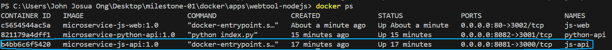
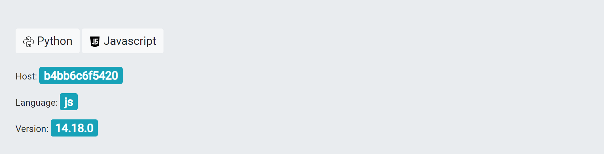

### Webtool fetching data from Python-api

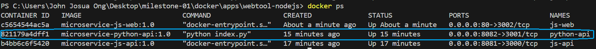
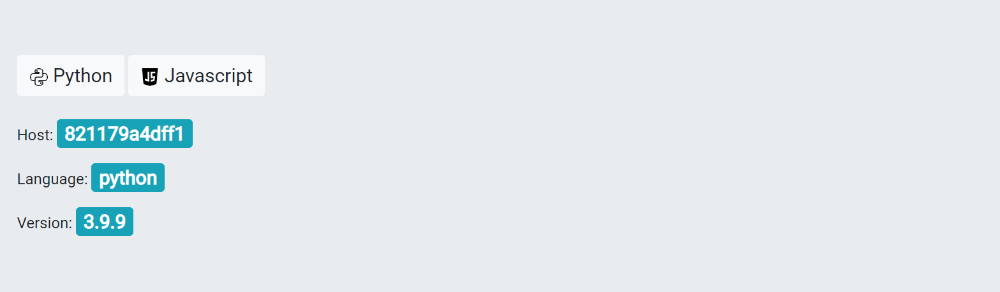
 
4. Lastly, you can check the logs of all the containers.

    ```bash
    # check logs for js-api
    docker logs js-api

    # check logs for python-api
    docker logs python-api

    # check logs for js-web
    docker logs js-web
    ```
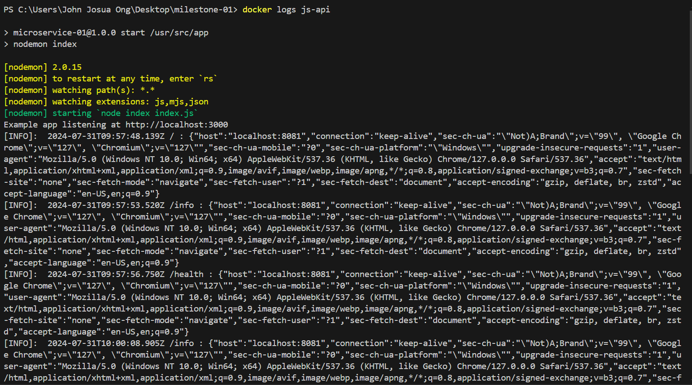
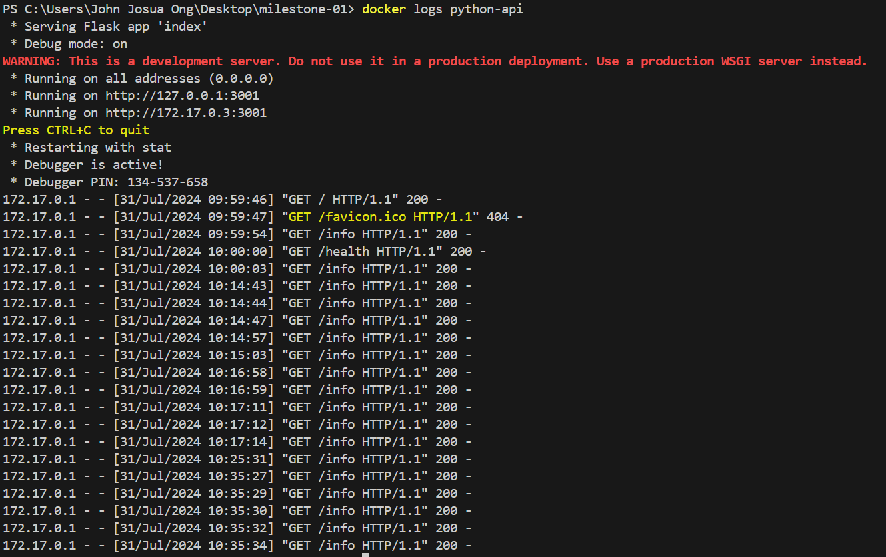
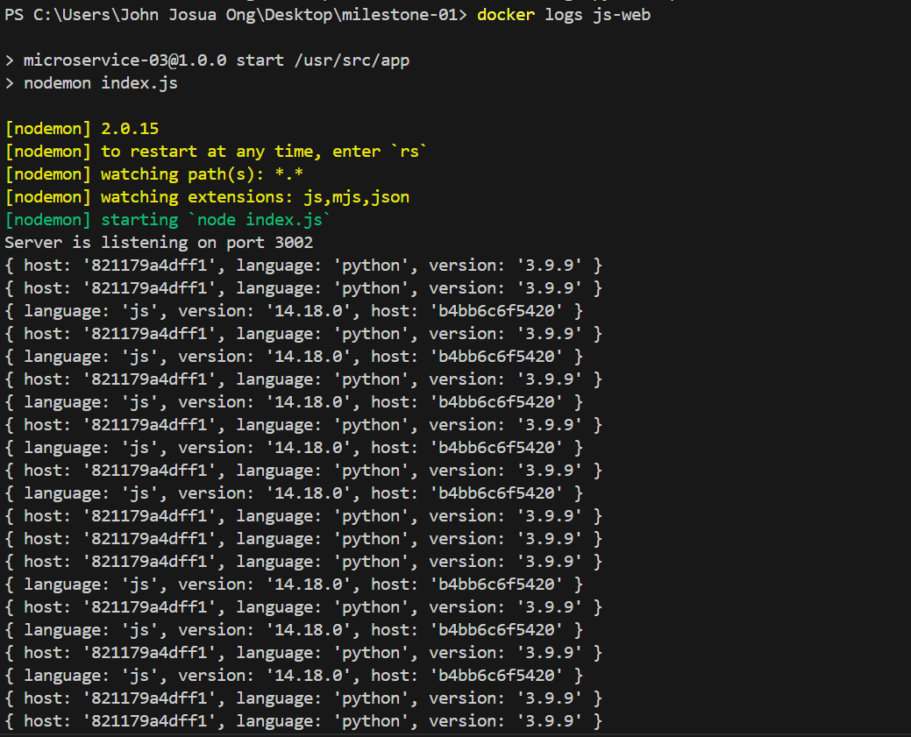


### Using Docker networks to link containers

1. Make sure to remove all running containers.

    ```bash
    # list running containers
    docker ps
    # CONTAINER ID   IMAGE                         COMMAND                  CREATED       STATUS          PORTS   
    ```

2. Create a docker network.

    ```bash
    # creating docker network
    docker network create microservice-network
    # list the docker networks
    docker network ls
    # NETWORK ID     NAME                   DRIVER    SCOPE
    # eb5076961372   bridge                 bridge    local
    # 6623132a35b0   host                   host      local
    # 705c353774c8   microservice-network   bridge    local
    ```

3. Run the containers and attach them to the network created previously.

    ```bash
    # run the JS and Python APIs and attach them to the previously created network
    docker run -d --network microservice-network --name js-api microservice-js-api:1.0
    docker run -d --network microservice-network --name python-api microservice-python-api:1.0
    # verify the containers that were just created.
    docker ps
    # CONTAINER ID   IMAGE                         COMMAND                  CREATED          STATUS          PORTS      NAMES
    # 532f056fb1d9   microservice-python-api:1.0   "python index.py"        2 seconds ago    Up 1 second     3001/tcp   python-api
    # 532f056fb1d9   microservice-python-api:1.0   "python index.py"        2 seconds ago    Up 1 second     3001/tcp   python-api
    ```
4. Run the webtool container and expose it to port 80 for web browser access. Pass in two environment variables (JS_API_ENDPOINT and PYTHON_API_ENDPOINT), using the container's name instead of localhost or host.docker.internal.

    ```bash
    # run the webtool container, attach it to the network, expose it on port 80, and use the names of the two API containers.
    docker run -d -p 80:3002 --network microservice-network -e JS_API_ENDPOINT="http://js-api:3000/info" -e PYTHON_API_ENDPOINT="http://python-api:3001/info" --name js-web microservice-js-web:1.0
    # verify the containers that were just created.
    docker ps
    # CONTAINER ID   IMAGE                         COMMAND                  CREATED         STATUS         PORTS                  NAMES
    # 943569f4f06a   microservice-js-web:1.0       "docker-entrypoint.s…"   2 seconds ago   Up 1 second    0.0.0.0:80->3002/tcp   js-web
    # 532f056fb1d9   microservice-python-api:1.0   "python index.py"        6 minutes ago   Up 6 minutes   3001/tcp               python-api
    # fc42b1836b45   microservice-js-api:1.0       "docker-entrypoint.s…"   7 minutes ago   Up 7 minutes   3000/tcp               js-api

    ```

5. Test and access the webtool through a web browser.

### Webtool fetching data from the JS API

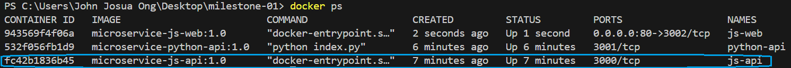
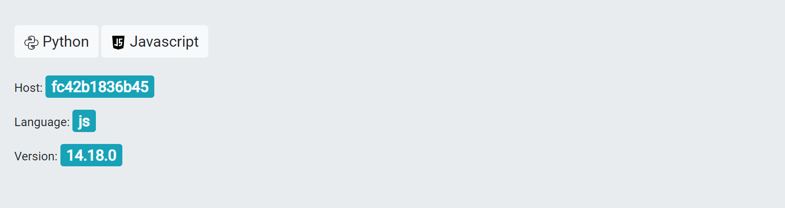

### Webtool fetching data from Python-api

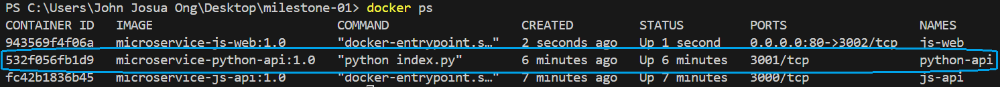


6. Lastly, you can check the logs of all the containers.

    ```bash
    # check logs for js-api
    docker logs js-api

    # check logs for python-api
    docker logs python-api

    # check logs for js-web
    docker logs js-web
    ```
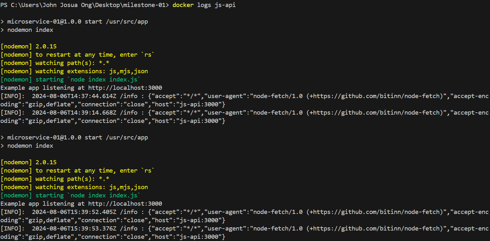
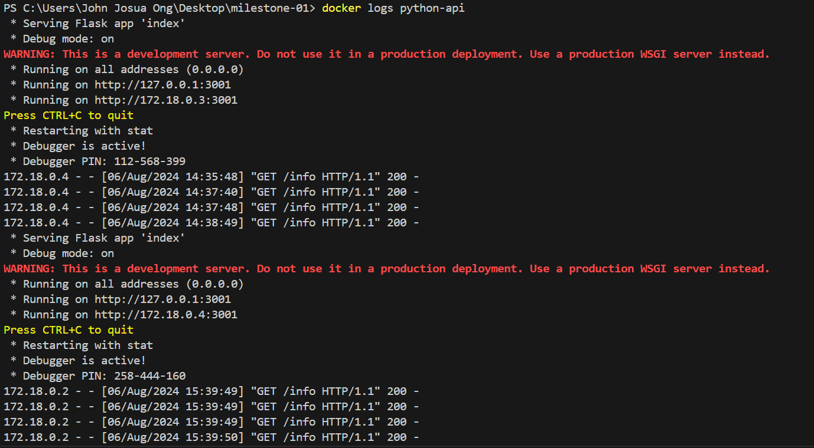
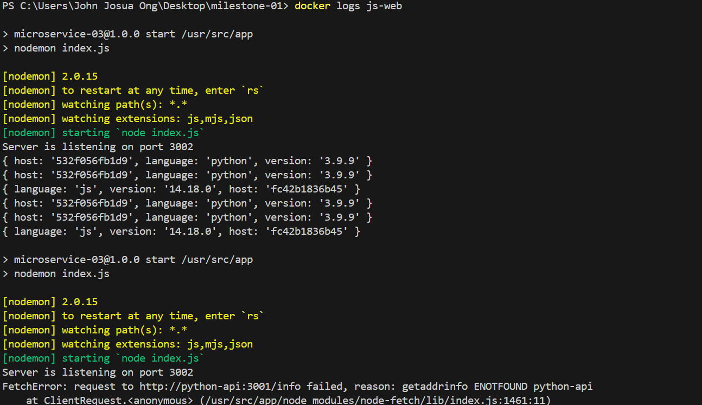


---
### Key takeways

1. To create optimized Docker images, implement best practices.

> a. By selecting a smaller base image and using a lower version, I optimized the Docker image size, reducing overall image size and enhancing performance.    
> b. Implementing labels in Dockerfiles helps organize images and provides valuable information for troubleshooting by tracking image metadata.    
> c. Modified the root user to a non-root user to create a more secure environment and implement the principle of least privilege. 
> d. Make sure to store the image in another repository for backup and disaster recovery   

2. Have an organized directory to store each system project.

> a. Separate applications into individual folders, including their dependencies, so that they are easily managed, version controlled, and deployed independently.  
> b. Include a README.md file with clear instructions for other colleagues to collaborate on this project.  
> c. Write clear commit messages that your colleagues can easily understand to improve project workflow.    

3. Always test each image or application independently.

> a. It will help track errors at an early stage, allowing for faster resolution of applications.   
> b. By testing images or applications independently, it is easier to collaborate with QAs, ensuring clear responsibilities.    

4. Store the systems in a repository for backup, recovery, and future improvements.

> a. This project uses GitLab for version control and as a repository.  
> b. Can be improved through automated builds and deployments.  

---