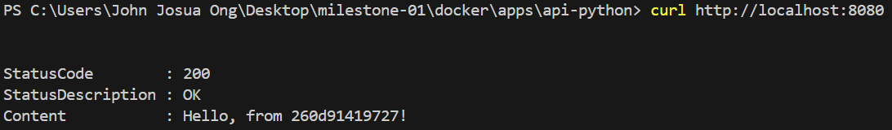
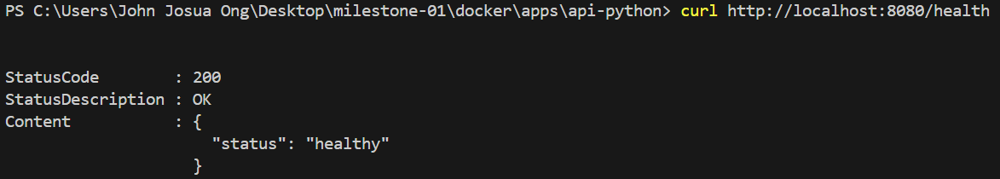
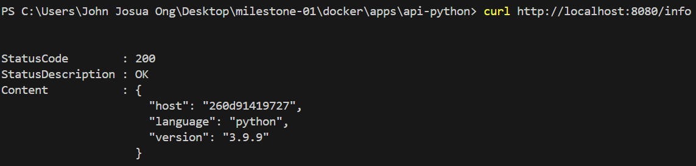
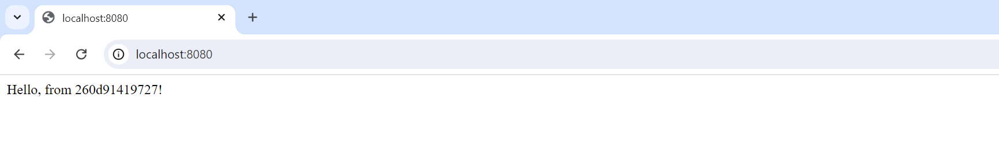
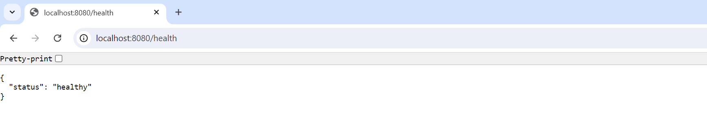
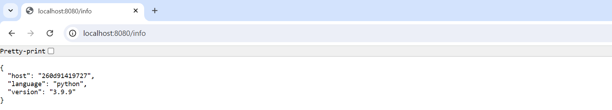

## Python API

1. We don't need to clone the project since we already clone it using SSH with the previous steps.

2. Explore the Python API directory.

    ```bash
    # change directory
    cd python-api

    # list and check the files within the Python API folder
    ls
    # index.py              - entrypoint of the code
    # requirement.txt       - packages and dependencies
    ```

3. To build the Python API container image, I created Dockerfile inside the directory and implement some best practices in building container image.

    ```Dockerfile
    FROM python:3.9.9-slim

    # adding label
    LABEL name ="Python API"\
        description ="Backend API"\
        authors="email" \
        company="Company/Orgname"

    # setup app directory
    WORKDIR /app

    # copy source code
    COPY . .

    # install packages/dependencies
    RUN pip3 install -r requirements.txt

    # expose port
    EXPOSE 3001

    #for non-root user
    RUN useradd -r -m node
    USER node

    # run application
    CMD [ "python", "index.py"]
    ```

4. Build the Python API container image using the newly created Dockerfile.

    ```bash
    # build image
    docker build -t microservice-python-api:1.0 .

    # list images to view the microservice-python-api image
    docker image ls
    # REPOSITORY                                                                     TAG       IMAGE ID       CREATED        SIZE
    # microservice-python-api                                                        1.0       5f379c914632   19 hours ago   133MB
    ```

5. Run a Python API container using the image that just built.

    ```bash
    # run the Python API container
    docker run -d -p 8080:3001 --name python-api microservice-python-api:1.0
    # -d                            # detached mode
    # -p 80:3001                    # mapping ports - local port:container port
    # --name python-api             # set name of container
    # microservice-python-api:1.0   # image name and tag

    # list running containers
    docker ps
    # CONTAINER ID   IMAGE                     COMMAND                  CREATED          STATUS          PORTS                  NAMES
    # 260d91419727   microservice-python-api:1.0   "python index.py"   4 minutes ago   Up 4 minutes   0.0.0.0:8080->3001/tcp   python-api 
    ```

6. Test and access the API via command line and browser.

    ```bash
    curl http://localhost:8080/
    # StatusCode        : 200
    # StatusDescription : OK
    # Content           : Hello, from 260d91419727!

    curl http://localhost:8080/health
    # StatusCode        : 200
    # StatusDescription : OK
    # Content           : {
                      "status": "healthy"
                         }

    curl http://localhost:8080/info
    # StatusCode        : 200
    # StatusDescription : OK
    # Content           : {
                      "host": "260d91419727",
                      "language": "python",
                      "version": "3.9.9"
                    }
    ```
    Here are the path exposed by the API.

    > a. Root - http://{ip}:{port}/  
    > b. Health Path - http://{ip}:{port}/health  
    > c. Info Path - http://{ip}:{port}/info  

### RESULT








---

The Python API container is running and functioning. Switch to the next step: Webtool.

---