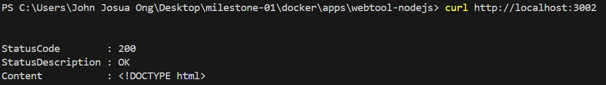
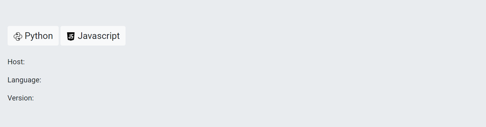

## Python API

1. We don't need to clone the project since we already clone it using SSH with the previous steps.

2. Explore the activity 3 Webtool directory.
    ```bash
    # change directory
    cd milestone-01/activity-03

    # list and check the files within the Python API folder
    ls
    # public                - images that will be use
    # view                  - front-end of webtool
    # index.js              - entrypoint of the code
    # .dockerignore         - used to exclude files and directories
    # package.json          - nodejs metadata, includes libraries and other info
    # package-lock.json     - other packages and dependencies
    ```

3. To build the Webtool container image, I created Dockerfile inside the activity 3 directory and implement some best practices in building container image.

    ```Dockerfile
    FROM node:14.18.0-slim

    # adding label
    LABEL name ="Webtool"\
        description ="Front web application"\
        authors="johnjosua.ong@stratpoint.com" \
        company="Stratpoint Technologies"

    # setup app directory
    WORKDIR /usr/src/app

    # copy package list
    COPY package*.json ./

    # install packages/dependencies
    RUN npm install

    # copy source code
    COPY . .

    # expose port
    EXPOSE 3002

    #for non-root user
    USER node

    # run application
    CMD [ "npm", "run", "start" ]
    ```

4. Build the Webtool container image using the newly created Dockerfile

    ```bash
    # build image
    docker build -t microservice-js-web:1.0 .

    # list images to view the microservice-js-web image
    docker image ls
    # REPOSITORY                                                                     TAG       IMAGE ID       CREATED        SIZE
    # microservice-js-web                                                            1.0       ddc08371b608   19 hours ago   174MB
    ```

5. Run a Webtool container using the image that just built.

    ```bash
    # run the Python API container
    docker run -d -p 3002:3002 --name js-web microservice-js-web:1.0
    # -d                        # detached mode
    # -p 3002:3002              # mapping ports - local port:container port
    # --name js-web             # set name of container
    # microservice-js-web:1.0   # image name and tag

    # list running containers
    docker ps
    # CONTAINER ID   IMAGE                     COMMAND                  CREATED          STATUS          PORTS                  NAMES
    # 588aea699a87   microservice-js-web:1.0   "docker-entrypoint.s…"   3 seconds ago   Up 2 seconds   0.0.0.0:3002->3002/tcp   js-web
    ```

6. Test and access the API via command line and browser. 

    ```bash
    curl http://localhost:3002/
    # StatusCode        : 200
    # StatusDescription : OK
    # Content           : <!DOCTYPE html>
    ```

### RESULT




---

The Webtool container is running, but it cannot connect to the backend APIs (JS and Python). Please refer to the root directory's README.md file for application integration instructions.

---