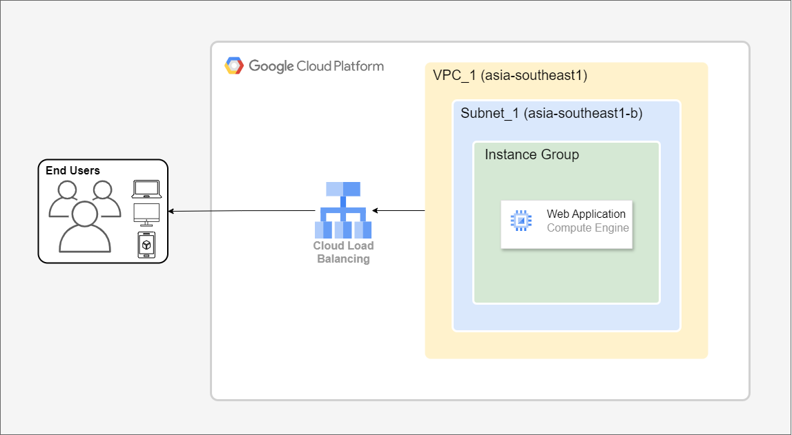
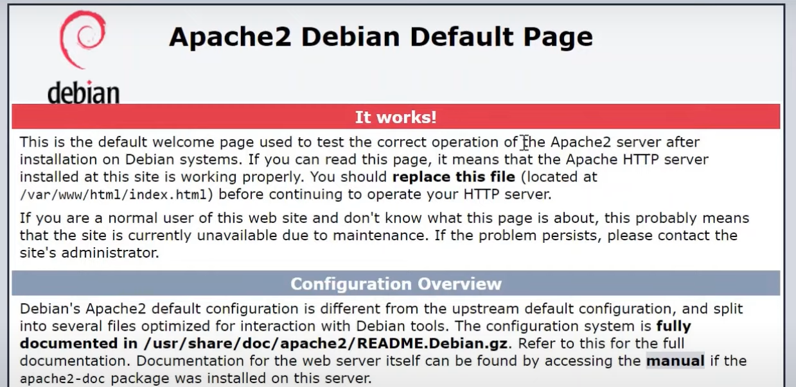
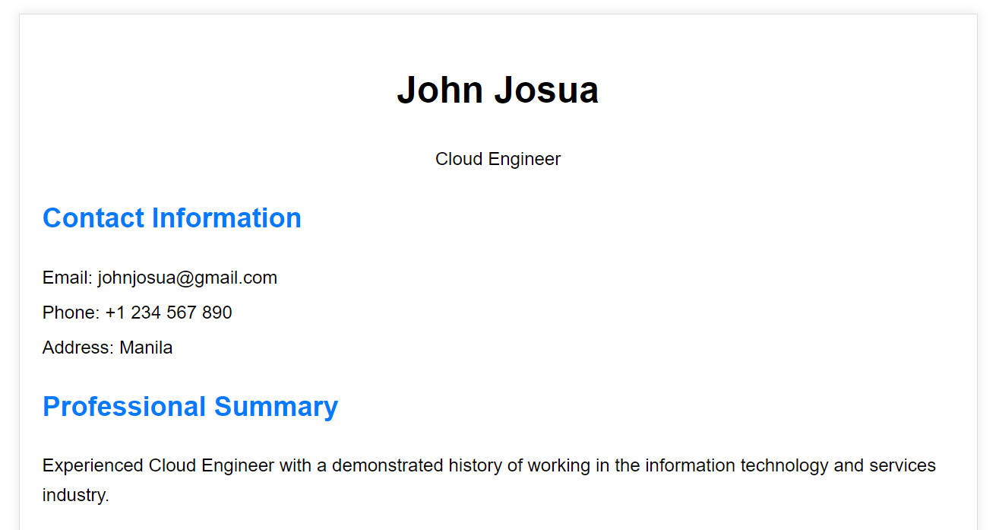

# Deploying Simple Application on Compute Engine

This project deploys a simple web application on Google Cloud Compute Engine, providing secure external access.

# Project Directory
Refer to this directory for the sample source code.

- [Simple web app](./Source-code)

## Table of Contents
* [Architecture and Functionalities](#architecture-and-funtionalities)
* [Prerequisites](#prerequisites)
* GCP Deployment


## Architecture and Functionalities

One option for deploying your application on Google Cloud Platform is to use Compute Engine. This provides a secure and accessible environment for your app.



As shown in the architecture diagram, the application is deployed to Compute Engine with the specified machine configurations based on the complexity of the application. It is accessible through a Load Balancer, which distributes traffic to the application instances.

## Prerequisites

1. Save the [source code](./Source-code) or any desired code you want to deploy on GCP.

2. If you don't have a GCP account, you can create one. New users are eligible for free credits. For setup instructions, please refer to this [link](https://cloud.google.com/free?hl=en).

3. Set up your GCP account, including billing, to access GCP services.

## GCP Deployment

1. After setting up your Google Cloud environment, enable the Compute Engine API to access and use the Compute Engine service.

2. Create a VPC to serve as the network infrastructure for your GCP cloud services.

3. Go to the Compute Engine page to create a new VM instance. Enter the following information and click "Create":

    * Name of the VM
    * Region and Zone
    * Machine Configuration - for testing use the lower specs atleast 2 vCPU and 1 GB memory.
    * Boot Disk - you can choose Debian for this project with atleast 10 GB Balanced Persistent Disk.
    * Allow HTTP and HTTPS - for the access of external users.
    * Network Interface - choose the created VCP within your environment.

4. After creating the VM instance, click its "SSH" button to connect to the server.

5. Once connected to your VM instance, run the following Bash script.

    ```
    # execute command as root user
    sudo -i

    # install dependecies
    apt-get update

    # install dependecies for your web server
    sudo apt-get install apache2
    ```

6. To confirm that Apache2 is running correctly on your VM, access its external IP address. You can then copy and paste this IP address into a web browser to test the connection. Refer the image for the expected output.



7. To deploy your application, access the server again and follow the deployment process.

    ```
    # access the web directory
    cd /var/www/html

    # to edit the index page
    nano index.html

    # but also you can remove it and create new one
    # delete index
    rm index.html

    # create new index
    nano index.html

    # in index.html input your source code here
    ```

8. Try accessing the external IP address again. It should now display the updated index page that you recently edited.




