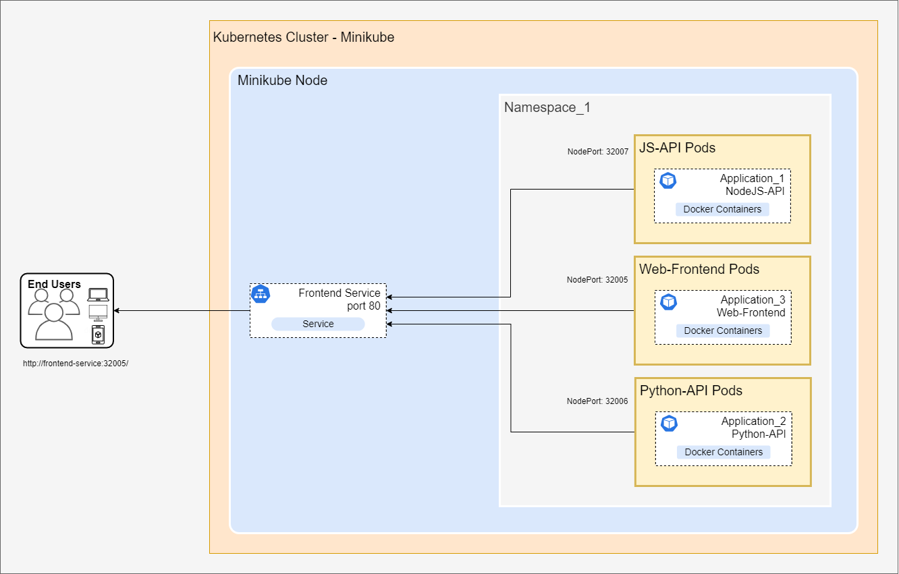

# Microservices
This project utilizes a microservices architecture, deploying containerized applications within a Minikube Kubernetes cluster. Kubernetes manifests orchestrate the deployment of each Pods, ensuring seamless delivery to user

# Project Directory
Refer to this directory for guidance on container setup with manifest files.

- [Config](./config-json) = Stores container registry credentials.
- [Secrets](./secrets) = contains sensitive information like container registry credentials, which are stored as part of the deployment.
- [Configmaps](./configmaps) = used to define environment variables that are used in the frontend.
- [Deployments](./deployments) = contains Kubernetes deployment manifests for deploying containers as Pods in the cluster.
- [Services](./services) = defines Kubernetes services that expose applications to other Pods and to users.

## Table of Contents
* [Architecture and Functionalities](#architecture-and-funtionalities)
* [Requirements](#requirements)


## Architecture and Funtionalities

### Project Overview

After building and pushing your container image to a registry, you can deploy it to a Kubernetes cluster. For local testing, consider using Minikube.

* Nodejs-API and Python-API - serve as backend services, providing data to the frontend application.
* Web Frontend - the user interface will display information from the backend APIs, which is accessed through environment variables.



As illustrated in the architecture diagram, the containerized images are deployed as Pods within the cluster. These Pods are grouped into namespaces for isolation. All Pods utilize NodePorts to enable external access through Services, facilitating communication between Pods and with end users. Access the web frontend at the NodePort of the web service (32005) to view the output of your microservices.

## Requirements

1. You can refer to the requirements of [previous project](./Dockerization) for initial setup. 

2. For added setup you need to install minukube as local cluster in your device.


# Integrations


1. You can use any hypervisor to run these containers in the cluster. In my case, I will use Minikube.

    ```bash
        # to start the minukube
        minikube start

        # verify if the minikube is runnin
        kubectl get nodes
        # NAME       STATUS   ROLES           AGE     VERSION
        # minikube   Ready    control-plane   7d12h   v1.30.0
    ```

2. Create namespaces to group your containers within the cluste

    ```bash
        # create namespace microservice-app, we will use this to group our resources
        kubectl create namespace microservice-app

        # verify if the namespace is created
        kubectl get namespaces
        # NAME               STATUS   AGE
        # default            Active   7d12h
        # microservice-app   Active   2d10h
    ```

3. After creating the namespace, go to the secrets directory to deploy the YAML file that will be used to access the containers from the container registry

    ```bash
        # create the secret yaml file
        kubectl create -f secret-cred.yaml
        # secret/docker-creds created

        # verify if the secret yaml is successfully created, declare also the namespace where we deploy it
        kubectl get secrets -n microservice-app
        # NAME           TYPE                             DATA   AGE
        # docker-creds   kubernetes.io/dockerconfigjson   1      70s
    ```

4. Go to the ConfigMaps directory to deploy the environment variables that the web application will use.

    ```bash
        # create the configmap yaml file
        kubectl create -f configs-js-python.yaml
        # configmap/js-config created

        # verify if the configmap yaml is successfully created, declare also the namespace where we deploy it
        kubectl get configmaps -n microservice-app
        # NAME               DATA   AGE
        # js-config          4      11s
    ```

5. Proceed to the deployment directory to deploy the containers

    ```bash
        # create the 3 deployment yaml file
        kubectl create -f js-api-deployment.yaml
        kubectl create -f python-api-deployment.yaml
        kubectl create -f js-web-deployment.yaml

        # verify if the deployment yaml files is successfully created, declare also the namespace where we deploy it
        kubect get deployments -n microservice-app
        # NAME                    READY   UP-TO-DATE   AVAILABLE   AGE
        # js-api-deployment       1/1     1            1           113s
        # js-web-deployment       1/1     1            1           97s
        # python-api-deployment   1/1     1            1           107s

        # you can also check the running pods 
        kubectl get pods -n microservice-app
        # NAME                                    READY   STATUS    RESTARTS   AGE
        # js-api-deployment-557c66f8df-sm7xd      1/1     Running   0          3m10s
        # js-web-deployment-756f4bc776-48p8v      1/1     Running   0          2m53s
        # python-api-deployment-d9b864c9f-pmrcg   1/1     Running   0          3m4s
    ```

6. Now expose it as a service, go to service directory and create the service yaml files.

    ```bash
        # create the 3 service yaml file
        kubectl create -f service-js-api.yaml
        kubectl create -f service-python-deployment.yaml
        kubectl create -f service-js-web.yaml

        # verify if the service yaml files is successfully created, declare also the namespace where we deploy it
        kubect get services -n microservice-app
        # NAME                 TYPE       CLUSTER-IP       EXTERNAL-IP   PORT(S)        AGE
        # js-api-service       NodePort   10.105.166.47    <none>        80:32007/TCP   91s
        # js-web-service       NodePort   10.105.97.56     <none>        80:32005/TCP   81s
        # python-api-service   NodePort   10.111.170.113   <none>        80:32006/TCP   72s
    ```

7. Run the services to access through your browser and verify if the output information are correct.

    ```bash
        # start the minikube services to access the pods
        minikube services js-api-service js-web-service python-api-service

        # go to the IP of js-web-service to check the output through the browsers
    ```
    
9. Additionally, you can use these manifest files to deploy these applications to the cloud.

---

The containers are finally working and ready for deployment to the cloud.

---
